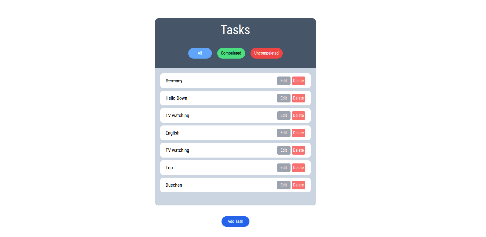

# ToDO list with Django 

## Description
  A web Aplication built with Django and Tailwind css and can handel daily tasks . 

## Technologies 
- Django 🚀  
- Tailwind CSS 🎨  
- HTML 📄
  
## Preview 

  

## Installation 
  1. Clone the repo:  
   `git clone https://github.com/Hamed-070/ToDo-list-with-Django.git`

  2. Create and activate a virtual environment:  
     `python -m venv venv`  
     `source venv/bin/activate` (Linux/macOS) or `venv\Scripts\activate` (Windows)
  
  3. Install dependencies:  
     `pip install -r requirements.txt`
  
  4. Apply migrations:  
     `python manage.py migrate`
  
  5. Run the development server:  
     `python manage.py runserver`
  
  6. Visit `http://127.0.0.1:8000/` in your browser.

